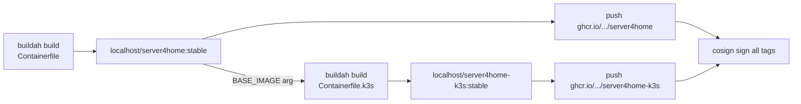

# When to refactor the build workflow to a GitHub Actions matrix

A pre-written migration recipe for the day server4home grows a third image
flavor (e.g. RKE2, MicroK8s, multi-arch, alternate kernel streams).
**Don't apply this now** — for the current `base + k3s` shape, the
single-job sequential build is faster and simpler. This doc exists so the
refactor is a copy-paste when the threshold arrives, not a re-think.

---

## Why the current single-job build is the right answer for 2 images

[`.github/workflows/build.yml`](../.github/workflows/build.yml) today
builds the base and K3s images in **one job, sequentially**, sharing local
containers-storage:



K3s is `FROM ${BASE_IMAGE}`; with both builds in the same job, the K3s
build resolves `localhost/server4home:stable` from the runner's local
storage with **zero registry round-trip**. Total wall time is roughly the
sum of two builds. A matrix here would either duplicate the base build per
row or force a registry push+pull between rows, both slower than what we
have.

---

## Trigger conditions — refactor when any of these become true

- You add a **third leaf flavor** (`Containerfile.rke2`, `Containerfile.microk8s`, etc.)
- You start building **multiple architectures** (`amd64` + `arm64`)
- You start building **multiple kernel streams** (stable / lts / testing)
- A single job exceeds ~50 min — GitHub-hosted-runner job limit pressure

Two leaves with parent-child dependency: stay sequential.
Three+ leaves, or any second axis of variation: matrix pays off.

---

## Target shape: two jobs, matrix for the leaves

```mermaid
flowchart LR
    subgraph job1["job: build_base (one runner)"]
        A1[buildah build<br/>Containerfile] --> A2[push ghcr.io/.../server4home]
        A2 --> A3[output: digest]
    end
    subgraph job2["job: build_variants (matrix N runners)"]
        B1[flavor=k3s<br/>buildah build Containerfile.k3s] --> B2[push -k3s]
        C1[flavor=rke2<br/>buildah build Containerfile.rke2] --> C2[push -rke2]
        D1[flavor=microk8s<br/>buildah build Containerfile.microk8s] --> D2[push -microk8s]
    end
    job1 -->|needs| job2
    job1 -->|BASE_IMAGE=...@digest| B1
    job1 -->|BASE_IMAGE=...@digest| C1
    job1 -->|BASE_IMAGE=...@digest| D1
    B2 & C2 & D2 --> Z[cosign signing<br/>per-row or aggregated]
```

Key invariant: **leaf rows pin the base image by digest, not by tag**.
Using `@sha256:...` (the digest output by `build_base`) means every matrix
row builds against the *exact* base produced this run — no race where two
rows could pick up different `:stable` snapshots if `:stable` rolls
mid-workflow.

---

## Concrete YAML — drop-in skeleton

The change preserves cosign + GHCR auth + metadata-action labels; only the
job structure shifts.

```yaml
jobs:

  build_base:
    name: Build and push base image
    runs-on: ubuntu-24.04
    permissions:
      contents: read
      packages: write
      id-token: write
    outputs:
      digest: ${{ steps.push.outputs.digest }}
      tags:   ${{ steps.metadata.outputs.tags }}
    steps:
      - uses: actions/checkout@08c6903cd8c0fde910a37f88322edcfb5dd907a8 # v5
      - uses: ublue-os/container-storage-action@911baca08baf30c8654933e9e9723cb399892140 # main
      - name: Image Metadata (base)
        uses: docker/metadata-action@c1e51972afc2121e065aed6d45c65596fe445f3f # v5
        id: metadata
        with:
          tags: |
            type=raw,value=${{ env.DEFAULT_TAG }}
            type=raw,value=${{ env.DEFAULT_TAG }}.{{date 'YYYYMMDD'}}
          labels: |
            # …same labels as today, see current workflow…
          sep-tags: " "
      - name: Build base
        uses: redhat-actions/buildah-build@7a95fa7ee0f02d552a32753e7414641a04307056 # v2
        with:
          containerfiles: ./Containerfile
          image: ${{ env.IMAGE_NAME }}
          tags: ${{ env.DEFAULT_TAG }}
          labels: ${{ steps.metadata.outputs.labels }}
          oci: false
      - name: Tag for registry
        run: |
          for tag in ${{ steps.metadata.outputs.tags }}; do
            podman tag ${{ env.IMAGE_NAME }}:${{ env.DEFAULT_TAG }} \
                       ${{ env.IMAGE_NAME }}:$tag
          done
      - uses: docker/login-action@5e57cd118135c172c3672efd75eb46360885c0ef # v3
        with:
          registry: ghcr.io
          username: ${{ github.actor }}
          password: ${{ secrets.GITHUB_TOKEN }}
      - name: Push base to GHCR
        id: push
        uses: redhat-actions/push-to-registry@5ed88d269cf581ea9ef6dd6806d01562096bee9c # v2
        with:
          registry: ${{ env.IMAGE_REGISTRY }}
          image: ${{ env.IMAGE_NAME }}
          tags: ${{ steps.metadata.outputs.tags }}

  build_variants:
    name: Build and push ${{ matrix.flavor.name }}
    needs: build_base
    runs-on: ubuntu-24.04
    permissions:
      contents: read
      packages: write
      id-token: write
    strategy:
      fail-fast: false                # one bad flavor shouldn't sink the rest
      matrix:
        flavor:
          - { name: k3s,      file: Containerfile.k3s,      keywords: "k3s,kubernetes" }
          - { name: rke2,     file: Containerfile.rke2,     keywords: "rke2,kubernetes" }
          - { name: microk8s, file: Containerfile.microk8s, keywords: "microk8s,kubernetes" }
    steps:
      - uses: actions/checkout@08c6903cd8c0fde910a37f88322edcfb5dd907a8 # v5
      - uses: ublue-os/container-storage-action@911baca08baf30c8654933e9e9723cb399892140 # main
      - name: Image Metadata (variant)
        uses: docker/metadata-action@c1e51972afc2121e065aed6d45c65596fe445f3f # v5
        id: metadata
        with:
          # Same shape as base, with title/source/keywords adjusted for the flavor.
          tags: |
            type=raw,value=${{ env.DEFAULT_TAG }}
            type=raw,value=${{ env.DEFAULT_TAG }}.{{date 'YYYYMMDD'}}
          labels: |
            org.opencontainers.image.title=${{ env.IMAGE_NAME }}-${{ matrix.flavor.name }}
            org.opencontainers.image.source=https://github.com/${{ github.repository_owner }}/${{ env.IMAGE_NAME }}/blob/${{ github.sha }}/${{ matrix.flavor.file }}
            io.artifacthub.package.keywords=${{ env.IMAGE_KEYWORDS }},${{ matrix.flavor.keywords }}
            containers.bootc=1
          sep-tags: " "
      - name: Build variant
        uses: redhat-actions/buildah-build@7a95fa7ee0f02d552a32753e7414641a04307056 # v2
        with:
          containerfiles: ./${{ matrix.flavor.file }}
          image: ${{ env.IMAGE_NAME }}-${{ matrix.flavor.name }}
          tags: ${{ env.DEFAULT_TAG }}
          labels: ${{ steps.metadata.outputs.labels }}
          build-args: |
            # Pin to digest, NOT :stable — avoids a race where two matrix
            # rows could pick up different `:stable` snapshots.
            BASE_IMAGE=${{ env.IMAGE_REGISTRY }}/${{ env.IMAGE_NAME }}@${{ needs.build_base.outputs.digest }}
          oci: false
      - name: Tag for registry
        run: |
          for tag in ${{ steps.metadata.outputs.tags }}; do
            podman tag ${{ env.IMAGE_NAME }}-${{ matrix.flavor.name }}:${{ env.DEFAULT_TAG }} \
                       ${{ env.IMAGE_NAME }}-${{ matrix.flavor.name }}:$tag
          done
      - uses: docker/login-action@5e57cd118135c172c3672efd75eb46360885c0ef # v3
        with:
          registry: ghcr.io
          username: ${{ github.actor }}
          password: ${{ secrets.GITHUB_TOKEN }}
      - name: Push variant to GHCR
        uses: redhat-actions/push-to-registry@5ed88d269cf581ea9ef6dd6806d01562096bee9c # v2
        with:
          registry: ${{ env.IMAGE_REGISTRY }}
          image: ${{ env.IMAGE_NAME }}-${{ matrix.flavor.name }}
          tags: ${{ steps.metadata.outputs.tags }}
      # cosign here, signing this row's image only (keeps signing parallel)
      - uses: sigstore/cosign-installer@d7543c93d881b35a8faa02e8e3605f69b7a1ce62 # v3.10.0
      - name: Sign variant
        env:
          COSIGN_PRIVATE_KEY: ${{ secrets.SIGNING_SECRET }}
        run: |
          FULL="${{ env.IMAGE_REGISTRY }}/${{ env.IMAGE_NAME }}-${{ matrix.flavor.name }}"
          for tag in ${{ steps.metadata.outputs.tags }}; do
            cosign sign -y --key env://COSIGN_PRIVATE_KEY "${FULL}:${tag}"
          done
```

The base image is also signed — add a cosign step in `build_base` mirroring
the per-variant one. Don't aggregate signing into a third job; per-row
signing keeps a failed flavor's signature failure isolated.

---

## Pitfalls & subtleties to expect

| Pitfall | Why it matters | Mitigation |
|---|---|---|
| `BASE_IMAGE=ghcr.io/.../base:stable` in leaves | Two matrix rows can race against a moving `:stable` | Always pin by `@digest` from `needs.build_base.outputs.digest` |
| Different runners → no shared local cache | Every leaf pulls the base from GHCR — slower than today's local build | Acceptable cost when you have ≥3 leaves; cheaper than serializing them |
| `fail-fast: true` (default) | One bad row cancels the rest mid-run | Set `fail-fast: false` — homelab builds want to see all failures, not just the first |
| Matrix expansion limits | GitHub allows up to 256 matrix rows per workflow | Plenty of headroom for any homelab scenario |
| Metadata-action labels | Each matrix row needs its own correct `title`/`source` | Compute labels in the matrix step, parameterized on `matrix.flavor` |
| Cosign secret available per-row | Yes — secrets are available in every job/step that needs them | No special setup |
| PR builds | Don't push or sign from PRs (current `if:` guards already encode this) | Keep the `if: github.event_name != 'pull_request'` guards |

---

## What to delete from the existing workflow

When you do the refactor:

- Delete the K3s-specific build/tag/push steps from `build_push` — they
  move into the matrix.
- Delete the second metadata step (`Image Metadata (K3s)`) — variants
  compute their own labels.
- Rename `build_push` → `build_base` and trim to base-only.
- The current cosign loop signs both images in one step; replace it with
  per-image signing in `build_base` and per-row signing in `build_variants`.

---

## Decision rule (TL;DR)

- **2 leaf flavors with parent-child dependency** (today): single job,
  sequential. ✓ current
- **3+ leaf flavors** *or* second axis of variation: split into
  `build_base` + `build_variants` matrix.
- **Don't pre-refactor.** The refactor cost is the same now or later;
  doing it later means the workflow stays simpler in the interim.
