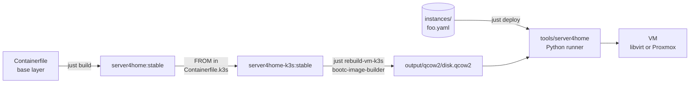
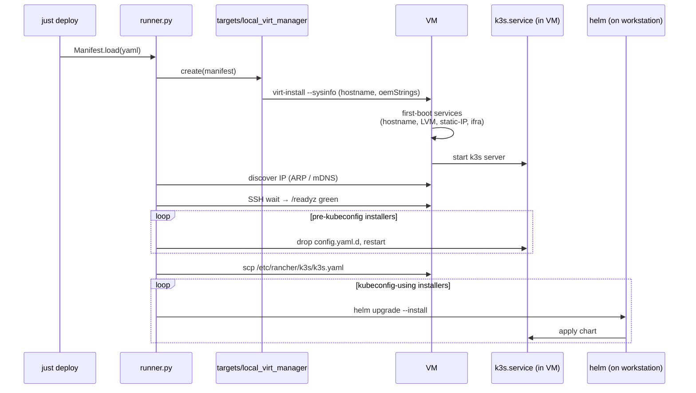

# server4home-k3s — build & deploy guide

How the pieces fit together when you've been away from this for a while.
The image is a fixed **platform** (K3s + Helm + first-boot services); each VM
is described by a YAML **manifest** under [`instances/`](../instances/); a
Python runner under [`tools/`](../tools/) turns the manifest into a running,
configured VM.

---

## 1. The build pipeline



- **Base layer** — ucore-hci (Fedora CoreOS 43) + your customizations.
- **K3s layer** — base + `/usr/bin/k3s` + `/usr/bin/helm` + first-boot services:
  `set-hostname`, `setup-rancher-data` (LVM), `network-static`, `ifra-register`.
- **BIB** converts the OCI image into a bootable qcow2 (xfs root).
- **Runner** reads a manifest, calls into target/provisioner/installer plugins,
  deploys the VM, applies helm charts over the resulting cluster.

There is **no longer** a "Rancher flavor" image. Rancher is now an installer
plugin that runs against any K3s cluster the runner brings up.

### Build commands

```bash
just build-k3s                              # base + K3s container image
just rebuild-vm-k3s                         # build-k3s + BIB -> output/qcow2/disk.qcow2
just rebuild-vm-k3s stable v1.35.4+k3s1     # pin a different K3s version
```

K3s version pin lives in [`Containerfile.k3s`](../Containerfile.k3s) and
[`Justfile`](../Justfile). Helm version pin lives in
[`build/k3s/install.sh`](../build/k3s/install.sh).

---

## 2. VM disk layout

Each VM gets **two disks**: a small immutable boot disk (the bootc root) and
a large data disk (LVM) holding `/var/lib/rancher` so it can grow without
juggling the OS partition.

```text
┌─────────────────────────────────────────────────────────────────────┐
│ VM (libvirt or Proxmox)                                             │
│                                                                     │
│  ┌──────────────────────┐         ┌──────────────────────────────┐  │
│  │ vda  (boot, ~64 GB)  │         │ vdb  (data, e.g. 100 GB+)    │  │
│  │  ┌─────┐ ┌─────────┐ │         │  ┌─────────────────────────┐ │  │
│  │  │ ESP │ │  /  xfs │ │         │  │ PV → VG `rancher`       │ │  │
│  │  │ EFI │ │  bootc  │ │         │  │       └─ LV `data` xfs  │ │  │
│  │  └─────┘ └─────────┘ │         │  │            ↓            │ │  │
│  │                      │         │  │   /var/lib/rancher      │ │  │
│  └──────────────────────┘         │  └─────────────────────────┘ │  │
│                                   └──────────────────────────────┘  │
└─────────────────────────────────────────────────────────────────────┘
                                                ↑
                            grow online with `lvextend` + `xfs_growfs`
```

Whether the data disk gets attached depends on the manifest's `disks:` list.

---

## 3. The manifest

Canonical example: [`instances/k3s-on-virt-manager.yaml`](../instances/k3s-on-virt-manager.yaml).

```yaml
base: k3s-base
hostname: rancher-cp-01
target: local-virt-manager

resources:
  memory: 16384
  vcpus: 4

disks:
  - path: /var/lib/rancher
    size: 100G
    type: lvm

network:
  - name: default
    type: bridge
    mac:
      provisioner: default          # default | fixed | ifra
    ip:
      provisioner: dhcp             # dhcp | static
      # static: 192.168.120.50/16
      # gateway: 192.168.1.1
      # dns: 192.168.1.1

install:
  - name: k3s
    args:
      - --disable=traefik
      - --disable=servicelb

  - name: rancher-manager
    version: v2.14.1
    config:
      hostname: rancher.lan.example.com
      bootstrapPassword: admin
      replicas: 1
      ingress:
        enabled: true
        tls:
          - secretName: rancher-tls
            hosts: [rancher.lan.example.com]
```

The shape mirrors the four extension points: `target:` picks the deployment
adapter; `network[].mac.provisioner` and `network[].ip.provisioner` pick the
provisioner plugins; each `install:` entry routes to an installer plugin by
`name`.

Validate without deploying:

```bash
just validate instances/foo.yaml
```

---

## 4. Deploy flow



`just deploy <manifest>`:

```bash
just deploy instances/k3s-on-virt-manager.yaml
```

The Justfile bootstraps `./.venv/` on first use (`pip install -e tools/`),
then runs `server4home deploy <manifest>`. The kubeconfig lands at
`./kubeconfigs/<hostname>.kubeconfig` for direct use.

---

## 5. Plugin architecture

Four extension points, all in [`tools/server4home/registry.py`](../tools/server4home/registry.py):

| Registry          | Location                                    | Built-ins (today)                       |
| ---               | ---                                         | ---                                     |
| `targets`         | `tools/server4home/targets/`                | `local-virt-manager`, `pve9` (stub)     |
| `mac_provisioners`| `tools/server4home/provisioners/mac.py`     | `default`, `fixed`, `ifra` (stub)       |
| `ip_provisioners` | `tools/server4home/provisioners/ip.py`      | `dhcp`, `static`                        |
| `installers`      | `tools/server4home/installers/`             | `k3s`, `cert-manager`, `rancher-manager`|

Adding a plugin is purely additive: subclass the right ABC, add a
`@<registry>.register("<key>")` decorator, import the module from its
subpackage's `__init__.py`. The runner picks it up by name from any manifest
that references it. See [`tools/README.md`](../tools/README.md) for a worked
example (Longhorn).

---

## 6. First-boot sequence inside the VM

Even with the runner doing most of the work from the workstation, four
oneshot services still run inside the VM at first boot to absorb the SMBIOS
inputs:

```mermaid
sequenceDiagram
    participant systemd
    participant netstatic as server4home-network-static
    participant hostname as server4home-hostname
    participant data as setup-rancher-data
    participant ifra as server4home-ifra-register
    participant k3s as k3s.service

    systemd->>netstatic: Before=NetworkManager.service
    netstatic->>netstatic: read SMBIOS OEM strings; if static IP requested,<br/>write NM keyfile
    systemd->>hostname: read SMBIOS; set exact hostname
    systemd->>data: claim unformatted disk → LVM → mount /var/lib/rancher
    par
        systemd->>ifra: POST mac+hostname to inventory (best-effort)
    and
        systemd->>k3s: After=hostname.service, setup-rancher-data.service
        k3s->>k3s: k3s server (reads /etc/rancher/k3s/config.yaml + .d)
    end
```

---

## 7. Day-2 operations

### Extend `/var/lib/rancher` when it fills up

```bash
# On the libvirt host:
sudo virsh blockresize <vm> --path /var/lib/libvirt/images/<vm>-data.qcow2 --size 200G

# On the VM:
sudo pvresize /dev/vdb
sudo lvextend -l +100%FREE /dev/rancher/data
sudo xfs_growfs /var/lib/rancher
```

All online; K3s keeps running.

### Upgrade a VM via bootc

```bash
# First-time switch to a registry-hosted image:
sudo bootc switch ghcr.io/dx4homelab/server4home-k3s:stable
# Subsequent upgrades:
sudo bootc upgrade --apply
```

The root deployment swaps atomically; `/var/lib/rancher` is on a different
disk and is untouched. `sudo bootc rollback` reverts to the prior deployment.

### Cluster admin

```bash
KUBECONFIG=./kubeconfigs/<vm>.kubeconfig kubectl get nodes
KUBECONFIG=./kubeconfigs/<vm>.kubeconfig helm list -A
```

---

## 8. Adding custom commands and hooks

Pick by use-case:

| What you want to run | Where it goes | Idempotency |
| --- | --- | --- |
| File goes into rootfs once at build | `build/k3s/files/<absolute-path>` (COPY'd into image) | Trivial — file is in `/usr` |
| Modify the image *during* build | Append to `build/k3s/install.sh` (runs inside `podman build`) | One-shot at build time |
| Run once on first boot of a VM | New `[Service] Type=oneshot` unit, like the existing first-boot services | Internal check (sentinel or live state) |
| Run on every K3s start | Drop-in `build/k3s/files/usr/lib/systemd/system/k3s.service.d/NN-foo.conf` | Make the command itself idempotent |
| Workload to install on the cluster | New installer plugin under `tools/server4home/installers/` | Helm is naturally idempotent (`helm upgrade --install`) |
| K3s startup flag | Add a key to [build/k3s/files/etc/rancher/k3s/config.yaml](../build/k3s/files/etc/rancher/k3s/config.yaml) | K3s re-applies on every start |

**Prefer K3s's native config over chmod/chown when possible.** K3s rewrites
its state files (kubeconfig, certs) on restart, so out-of-band file changes
get clobbered. Use `config.yaml` or `config.yaml.d/` instead.

For operator-overridable config (not baked, dropped on the VM at deploy time),
use `/etc/rancher/k3s/config.yaml.d/*.yaml` — K3s merges those over the
image-baked `config.yaml`. This is the same mechanism the `k3s` installer
plugin uses to apply manifest-supplied `args:`.

---

## 9. Where things live in this repo

| Path | Purpose |
| --- | --- |
| [Containerfile](../Containerfile) | Base server4home image |
| [Containerfile.k3s](../Containerfile.k3s) | Layered K3s image |
| [build/k3s/install.sh](../build/k3s/install.sh) | K3s + Helm install at image-build time |
| [build/k3s/files/](../build/k3s/files/) | All files baked into the K3s image rootfs |
| [build/k3s/files/usr/libexec/server4home/setup-rancher-data.sh](../build/k3s/files/usr/libexec/server4home/setup-rancher-data.sh) | First-boot LVM setup |
| [build/k3s/files/usr/libexec/server4home/set-hostname.sh](../build/k3s/files/usr/libexec/server4home/set-hostname.sh) | First-boot hostname (exact mode + prefix-suffix fallback) |
| [build/k3s/files/usr/libexec/server4home/network-static.sh](../build/k3s/files/usr/libexec/server4home/network-static.sh) | First-boot static-IP NM keyfile writer |
| [build/k3s/files/usr/libexec/server4home/ifra-register.sh](../build/k3s/files/usr/libexec/server4home/ifra-register.sh) | First-boot inventory registration |
| [build/k3s/files/etc/rancher/k3s/config.yaml](../build/k3s/files/etc/rancher/k3s/config.yaml) | Baked K3s config (kubeconfig perms, etc.) |
| [build/k3s/files/etc/server4home/k3s.conf.example](../build/k3s/files/etc/server4home/k3s.conf.example) | K3s runtime mode config template |
| [iso/disk.toml](../iso/disk.toml) | BIB qcow2/raw partitioning + baked user |
| [iso/iso.toml](../iso/iso.toml) | Anaconda ISO kickstart |
| [Justfile](../Justfile) | All build/run/deploy recipes |
| [instances/](../instances/) | Per-VM YAML manifests |
| [tools/](../tools/) | Python deploy runner (`server4home` CLI) |
| [tools/server4home/](../tools/server4home/) | Runner package source |
| [tools/README.md](../tools/README.md) | Runner CLI quickstart + plugin authoring |
| [helpers/proxmox/create-rancher-vm.sh](../helpers/proxmox/create-rancher-vm.sh) | Manual Proxmox provisioning (until `pve9` target lands) |
| [helpers/network/set-correct-bridge.sh](../helpers/network/set-correct-bridge.sh) | One-shot host bridge setup (br0) |
