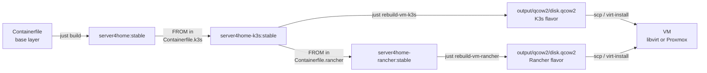
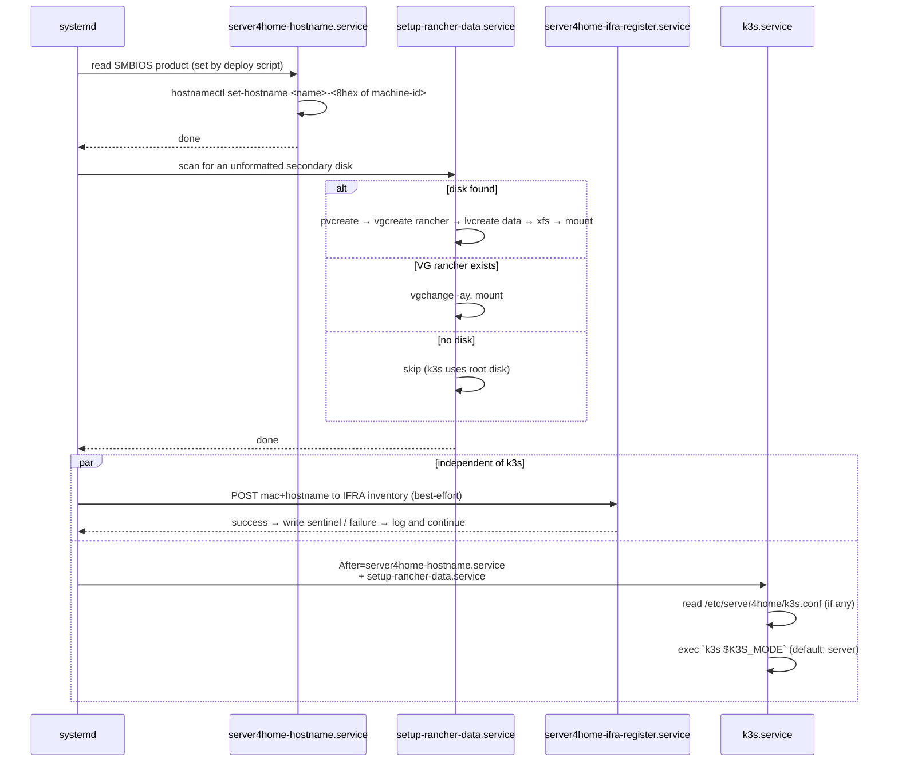
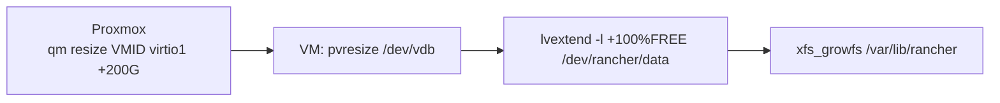

# server4home-k3s — build & deploy guide

A reminder of how the pieces fit together when you've been away from this for a
while. Covers: building the image, deploying VMs (libvirt or Proxmox), the LVM
data-disk pattern, and day-2 operations.

---

## 1. The build pipeline



- Base layer = ucore-hci (Fedora CoreOS 43) + your customizations.
- K3s layer = base + `/usr/bin/k3s` + systemd unit + first-boot LVM setup +
  hostname/IFRA services.
- Rancher layer = K3s layer + `/usr/bin/helm` + first-boot oneshot that
  helm-installs cert-manager and Rancher Manager.
- BIB converts the chosen OCI container image into a bootable qcow2 (xfs root).

### Build commands

```bash
# K3s flavor
just build-k3s                              # base + K3s container image
just rebuild-vm-k3s                         # build-k3s + BIB → output/qcow2/disk.qcow2
just rebuild-vm-k3s stable v1.35.4+k3s1     # pin a different K3s version

# Rancher flavor (K3s + cert-manager + Rancher Manager auto-installed on first boot)
just build-rancher                          # base + K3s + Rancher container image
just rebuild-vm-rancher                     # build-rancher + BIB → output/qcow2/disk.qcow2
just rebuild-vm-rancher stable v3.21.0      # pin a different Helm version
```

Default version pins live in the respective Containerfiles:
[Containerfile.k3s](../Containerfile.k3s) (K3s) and
[Containerfile.rancher](../Containerfile.rancher) (Helm). cert-manager and
Rancher chart versions are pinned in
[build/rancher/files/usr/libexec/server4home/rancher-bootstrap.sh](../build/rancher/files/usr/libexec/server4home/rancher-bootstrap.sh).

---

## 2. VM disk layout

Each VM gets **two disks**: a small boot disk (immutable bootc root) and a large
data disk (LVM, where `/var/lib/rancher` lives so it can grow without juggling
the OS partition).

```text
┌─────────────────────────────────────────────────────────────────────┐
│ VM (Proxmox / libvirt)                                              │
│                                                                     │
│  ┌──────────────────────┐         ┌──────────────────────────────┐  │
│  │ vda  (boot, ~64 GB)  │         │ vdb  (data, e.g. 100 GB+)    │  │
│  │  ┌─────┐ ┌─────────┐ │         │  ┌─────────────────────────┐ │  │
│  │  │ ESP │ │  /  xfs │ │         │  │ PV → VG `rancher`       │ │  │
│  │  │ EFI │ │  bootc  │ │         │  │       └─ LV `data` xfs  │ │  │
│  │  └─────┘ └─────────┘ │         │  │            ↓            │ │  │
│  │                      │         │  │   /var/lib/rancher      │ │  │
│  └──────────────────────┘         │  └─────────────────────────┘ │  │
│                                   └──────────────────────────────┘  │
└─────────────────────────────────────────────────────────────────────┘
                                                ↑
                            grow online with `lvextend` + `xfs_growfs`
```

The boot disk is treated as disposable — `bootc upgrade` and reboot replaces the
root deployment; nothing on it should be unique to this VM. **All state lives
on the data disk**, including K3s's containerd, etcd/sqlite, kubelet, and any
local-path-provisioner persistent volumes.

---

## 3. First-boot sequence inside the VM



All four services are idempotent. The hostname service no-ops if the host
already has a non-`localhost` name. The data service no-ops if `/var/lib/rancher`
is already mounted. The IFRA service writes a sentinel on success so it does
not re-POST on every boot. K3s starts only after the first two have completed
— its node name is the just-assigned hostname, so it registers correctly.

---

## 4. Deploying VMs

### 4a. libvirt (local development on this workstation)

```bash
# Boot disk only (current behavior — k3s runs on root disk)
just import-libvirt server4home-k3s

# Boot disk + 100 GB data disk (LVM first-boot service will claim it)
just import-libvirt server4home-k3s 8192 4 br0 100G

# Same + static IP (DHCP by default; this overrides at first boot)
just import-libvirt server4home-k3s 8192 4 br0 100G \
    "192.168.120.50/16,192.168.1.1,192.168.1.1"
```

Positional args: `vm_name memory vcpus bridge data_disk_size static_net`.
The `static_net` CSV is `addr/cidr,gateway,dns`; leave empty for DHCP. It's
passed to the VM via SMBIOS OEM strings; the image's first-boot
`server4home-network-static.service` reads them with `dmidecode -t 11` and
writes a NetworkManager keyfile **before NM starts**, so the VM comes up on
the static IP from the first lease attempt. On re-imports, an existing
`<vm-name>-data.qcow2` is preserved (delete it manually with `sudo rm` if you
want a clean slate). For DHCP, find the VM's IP via your router or Cockpit
Client.

### 4b. Proxmox (the real homelab path)

```bash
# 1) Push the qcow2 and helper to the Proxmox host once.
scp output/qcow2/disk.qcow2 \
    root@pve:/var/lib/vz/template/iso/server4home-k3s.qcow2
scp helpers/proxmox/create-rancher-vm.sh root@pve:/root/

# 2) Create the VM (on the Proxmox host).
ssh root@pve
./create-rancher-vm.sh \
    --vmid 200 --name rancher-cp-01 \
    --qcow2 /var/lib/vz/template/iso/server4home-k3s.qcow2 \
    --memory 16384 --cores 4 \
    --disk-size 64G --data-disk-size 100G \
    --start
```

`--data-disk-size` attaches a second blank disk; the first-boot service picks
it up automatically.

See `./create-rancher-vm.sh --help` for all options (bridge, storage, VLAN,
`--dry-run`, etc.).

### Hostname source

Both deploy paths inject the VM name into SMBIOS (`virt-install --sysinfo
system.product=…` / `qm set --smbios1 product=…`). On first boot,
`server4home-hostname.service` reads it from `/sys/class/dmi/id/product_name`
and sets the hostname to `<vm-name>-<8-hex-from-machine-id>`. Examples:

- `just import-libvirt rancher-cp-01 …` → hostname `rancher-cp-01-3f9ab21c`
- `create-rancher-vm.sh --name rancher-worker-02 …` → hostname `rancher-worker-02-7d2e0f6a`

Override the prefix manually by writing
`/etc/server4home/hostname-prefix` (single line) before first boot.

### Inventory registration (IFRA)

`server4home-ifra-register.service` POSTs `{mac, hostname, interface}` to
`https://ifra.local.homelabsolutions.nen/api/ifra/mac-addresses/reserve-mac-address`
on first boot. Failures are logged and ignored; the service retries on next
boot until a sentinel at `/var/lib/server4home/.ifra-registered` records
success. To point at a different endpoint or skip TLS verification, drop:

```bash
# /etc/server4home/ifra.conf
IFRA_URL=https://ifra.example.lan/api/ifra/mac-addresses/reserve-mac-address
IFRA_INSECURE=1
```

---

## 5. Cluster topology

The K3s image is mode-agnostic — runtime config decides whether each node
starts a new cluster or joins an existing one. Drop the appropriate file at
`/etc/server4home/k3s.conf` **before** first boot.

| Goal | k3s.conf | Notes |
| --- | --- | --- |
| Single-node new cluster | (no file) | Defaults: `K3S_MODE=server`. |
| New HA control-plane (first node) | `K3S_MODE=server` (no URL) | Start it; copy `/var/lib/rancher/k3s/server/node-token`. |
| Additional HA control-plane | `K3S_MODE=server` + `K3S_URL=https://cp1:6443` + `K3S_TOKEN=…` | Joins existing CP. |
| Worker node | `K3S_MODE=agent` + `K3S_URL=…` + `K3S_TOKEN=…` | No control plane on this node. |

Reference template: [build/k3s/files/etc/server4home/k3s.conf.example](../build/k3s/files/etc/server4home/k3s.conf.example).

### Rancher flavor — when it activates

When you boot `server4home-rancher`, an extra service
(`rancher-bootstrap.service`) runs after K3s is up and helm-installs
cert-manager + Rancher Manager. It:

- **Skips on agent nodes** (`K3S_MODE=agent`) — Rancher only makes sense on the
  control-plane.
- **Skips if Rancher already exists** in `cattle-system` namespace — safe to
  run on additional HA CP nodes joining an existing cluster.
- **Records success** in `/var/lib/server4home/.rancher-bootstrap-done` and
  doesn't re-run on subsequent boots.

Pre-boot config (drop into `/etc/server4home/rancher.conf` before first boot,
based on [rancher.conf.example](../build/rancher/files/etc/server4home/rancher.conf.example)):

```bash
RANCHER_HOSTNAME=rancher.lan.example.com
RANCHER_BOOTSTRAP_PASSWORD=changeme
# Optional: RANCHER_CHART_VERSION, CERT_MANAGER_VERSION, RANCHER_REPLICAS
```

After the service finishes (typically 5–15 min on first boot), Rancher's UI is
at `https://$RANCHER_HOSTNAME/`. Watch progress:

```bash
sudo journalctl -u rancher-bootstrap -f
kubectl get pods -n cattle-system
```

---

## 6. Day-2 operations

### Extend `/var/lib/rancher` when it fills up



All steps are online; K3s keeps running.

```bash
# On Proxmox host:
qm resize 200 virtio1 +200G

# On the VM:
sudo pvresize /dev/vdb
sudo lvextend -l +100%FREE /dev/rancher/data
sudo xfs_growfs /var/lib/rancher
df -h /var/lib/rancher                # confirm new size
```

### Upgrade a VM via bootc

```bash
# First time (point at the registry image — only needed once per VM):
sudo bootc switch ghcr.io/dx4homelab/server4home-k3s:stable

# Subsequent upgrades (pull a newer digest of the same ref):
sudo bootc upgrade --apply           # --apply auto-reboots
```

The root deployment swaps atomically; `/var/lib/rancher` is untouched (different
disk). If the new image regresses, `sudo bootc rollback` reverts to the
previous deployment on next boot.

### Inspect cluster state

```bash
sudo systemctl status k3s
sudo k3s kubectl get nodes
sudo k3s kubectl get pods -A
sudo journalctl -u k3s --since "10 min ago"
```

---

## 7. Adding custom commands and hooks

Pick by use-case:

| What you want to run | Where it goes | Idempotency |
| --- | --- | --- |
| Drop a file into the image rootfs | Add it under `build/k3s/files/<absolute-path>` (COPY'd into image) | Trivial — file is in `/usr` and immutable |
| Modify the image *during* build | Append to `build/k3s/install.sh` (runs inside `podman build`) | One-shot at build time |
| Run once on first boot of a VM | New `[Service] Type=oneshot` unit, like [setup-rancher-data.service](../build/k3s/files/usr/lib/systemd/system/setup-rancher-data.service) | Internal check (sentinel file or live state) |
| Run on every start of K3s | Drop-in `build/k3s/files/usr/lib/systemd/system/k3s.service.d/NN-foo.conf` with `ExecStartPre`/`ExecStartPost` | Make the command itself idempotent |
| Run on every boot (independent of K3s) | New unit with `WantedBy=multi-user.target`, baked under `build/k3s/files/usr/lib/systemd/system/` | Same |
| Config K3s itself supports natively | Add a key to [build/k3s/files/etc/rancher/k3s/config.yaml](../build/k3s/files/etc/rancher/k3s/config.yaml) | K3s re-applies on every start |

**Prefer K3s's native config over chmod/chown when possible.** K3s rewrites its
state files (kubeconfig, certs, manifests) on restart, so out-of-band changes
get clobbered. Anything with a corresponding K3s flag should go in
`config.yaml`. Example, already baked in:

```yaml
# build/k3s/files/etc/rancher/k3s/config.yaml
write-kubeconfig-mode: "0640"
write-kubeconfig-group: "wheel"
```

That lets `developer` (a wheel member) run `kubectl --kubeconfig
/etc/rancher/k3s/k3s.yaml get nodes` without `sudo`.

For things K3s does **not** natively configure, use a systemd drop-in baked
into the image. Example shape:

```ini
# build/k3s/files/usr/lib/systemd/system/k3s.service.d/20-example.conf
[Service]
# Wait for K3s to finish writing its state, then run our action.
ExecStartPost=/bin/sh -c 'until [ -f /etc/rancher/k3s/k3s.yaml ]; do sleep 0.2; done'
ExecStartPost=/usr/local/bin/my-post-start.sh
```

Drop-ins under `/usr/lib/systemd/system/<unit>.d/` layer on top of the main
unit without modifying it — preferred over editing `k3s.service` directly.

For *operator-overridable* config (not baked, dropped onto the VM at deploy
time), use `/etc/rancher/k3s/config.yaml.d/*.yaml` — K3s merges those over the
image-baked `config.yaml`.

---

## 8. Where things live in this repo

| Path | Purpose |
| --- | --- |
| [Containerfile](../Containerfile) | Base server4home image |
| [Containerfile.k3s](../Containerfile.k3s) | Layered K3s image |
| [Containerfile.rancher](../Containerfile.rancher) | Layered Rancher Manager image (FROM K3s) |
| [build/k3s/install.sh](../build/k3s/install.sh) | K3s binary install at image-build time |
| [build/rancher/install.sh](../build/rancher/install.sh) | Helm binary install at image-build time |
| [build/rancher/files/usr/libexec/server4home/rancher-bootstrap.sh](../build/rancher/files/usr/libexec/server4home/rancher-bootstrap.sh) | First-boot helm install of cert-manager + Rancher |
| [build/rancher/files/etc/server4home/rancher.conf.example](../build/rancher/files/etc/server4home/rancher.conf.example) | Rancher runtime config template |
| [build/k3s/files/](../build/k3s/files/) | All files baked into the K3s image rootfs |
| [build/k3s/files/usr/libexec/server4home/setup-rancher-data.sh](../build/k3s/files/usr/libexec/server4home/setup-rancher-data.sh) | First-boot LVM setup |
| [build/k3s/files/usr/libexec/server4home/set-hostname.sh](../build/k3s/files/usr/libexec/server4home/set-hostname.sh) | First-boot hostname assignment (SMBIOS product + machine-id) |
| [build/k3s/files/usr/libexec/server4home/network-static.sh](../build/k3s/files/usr/libexec/server4home/network-static.sh) | First-boot static-IP NM keyfile writer (reads SMBIOS OEM strings) |
| [build/k3s/files/usr/libexec/server4home/ifra-register.sh](../build/k3s/files/usr/libexec/server4home/ifra-register.sh) | Best-effort MAC+hostname registration with the IFRA inventory API |
| [build/k3s/files/usr/lib/systemd/system/k3s.service](../build/k3s/files/usr/lib/systemd/system/k3s.service) | K3s unit (env-driven mode) |
| [build/k3s/files/etc/server4home/k3s.conf.example](../build/k3s/files/etc/server4home/k3s.conf.example) | Runtime mode config template |
| [build/k3s/files/etc/rancher/k3s/config.yaml](../build/k3s/files/etc/rancher/k3s/config.yaml) | K3s-native config baked in (kubeconfig perms, etc.) |
| [iso/disk.toml](../iso/disk.toml) | BIB qcow2/raw partitioning + baked user |
| [iso/iso.toml](../iso/iso.toml) | Anaconda ISO kickstart |
| [Justfile](../Justfile) | All build/run/import recipes |
| [helpers/proxmox/create-rancher-vm.sh](../helpers/proxmox/create-rancher-vm.sh) | Proxmox VM provisioning |
| [helpers/network/set-correct-bridge.sh](../helpers/network/set-correct-bridge.sh) | One-shot host bridge setup (br0) |
