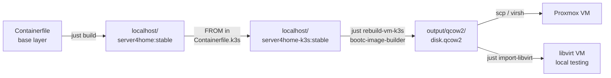
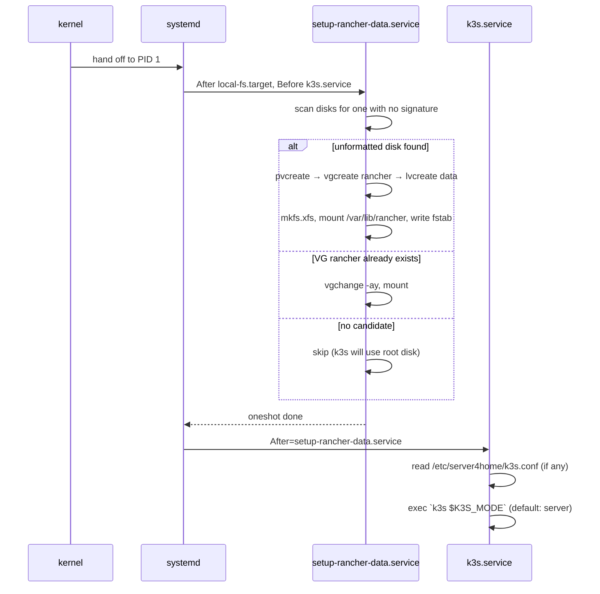
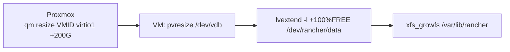

# server4home-k3s — build & deploy guide

A reminder of how the pieces fit together when you've been away from this for a
while. Covers: building the image, deploying VMs (libvirt or Proxmox), the LVM
data-disk pattern, and day-2 operations.

---

## 1. The build pipeline



- Base layer = ucore-hci (Fedora CoreOS 43) + your customizations.
- K3s layer = base + `/usr/bin/k3s` + systemd unit + first-boot LVM setup.
- BIB converts the OCI container image into a bootable qcow2 (xfs root).

### Build commands

```bash
just build-k3s                       # base + K3s container image
just rebuild-vm-k3s                  # forces build-k3s, then BIB → output/qcow2/disk.qcow2
just rebuild-vm-k3s stable v1.35.4+k3s1   # pin a different K3s version
```

The default K3s version pin lives in [Containerfile.k3s](../Containerfile.k3s) and
[Justfile](../Justfile) (`build-k3s` recipe).

---

## 2. VM disk layout

Each VM gets **two disks**: a small boot disk (immutable bootc root) and a large
data disk (LVM, where `/var/lib/rancher` lives so it can grow without juggling
the OS partition).

```
┌─────────────────────────────────────────────────────────────────────┐
│ VM (Proxmox / libvirt)                                              │
│                                                                     │
│  ┌──────────────────────┐         ┌──────────────────────────────┐  │
│  │ vda  (boot, ~64 GB)  │         │ vdb  (data, e.g. 100 GB+)    │  │
│  │  ┌─────┐ ┌─────────┐ │         │  ┌─────────────────────────┐ │  │
│  │  │ ESP │ │  /  xfs │ │         │  │ PV → VG `rancher`       │ │  │
│  │  │ EFI │ │  bootc  │ │         │  │       └─ LV `data` xfs  │ │  │
│  │  └─────┘ └─────────┘ │         │  │            ↓            │ │  │
│  │                      │         │  │   /var/lib/rancher      │ │  │
│  └──────────────────────┘         │  └─────────────────────────┘ │  │
│                                   └──────────────────────────────┘  │
└─────────────────────────────────────────────────────────────────────┘
                                                ↑
                            grow online with `lvextend` + `xfs_growfs`
```

The boot disk is treated as disposable — `bootc upgrade` and reboot replaces the
root deployment; nothing on it should be unique to this VM. **All state lives
on the data disk**, including K3s's containerd, etcd/sqlite, kubelet, and any
local-path-provisioner persistent volumes.

---

## 3. First-boot sequence inside the VM



Idempotent on every boot. If you ever boot the VM without a data disk, K3s just
runs on the root disk — no failure, no surprises.

---

## 4. Deploying VMs

### 4a. libvirt (local development on this workstation)

```bash
just import-libvirt server4home-k3s              # boots on br0 with DHCP
# In Cockpit Client → localhost → Virtual Machines, or:
ssh developer@<vm-ip-from-router>
```

The libvirt import doesn't add a data disk by default. To test the LVM path
locally, attach one before first boot:

```bash
sudo qemu-img create -f qcow2 /var/lib/libvirt/images/server4home-k3s-data.qcow2 100G
sudo virsh attach-disk server4home-k3s \
    /var/lib/libvirt/images/server4home-k3s-data.qcow2 vdb \
    --persistent --subdriver qcow2
sudo virsh destroy server4home-k3s && sudo virsh start server4home-k3s
```

### 4b. Proxmox (the real homelab path)

```bash
# 1) Push the qcow2 and helper to the Proxmox host once.
scp output/qcow2/disk.qcow2 \
    root@pve:/var/lib/vz/template/iso/server4home-k3s.qcow2
scp helpers/proxmox/create-rancher-vm.sh root@pve:/root/

# 2) Create the VM (on the Proxmox host).
ssh root@pve
./create-rancher-vm.sh \
    --vmid 200 --name rancher-cp-01 \
    --qcow2 /var/lib/vz/template/iso/server4home-k3s.qcow2 \
    --memory 16384 --cores 4 \
    --disk-size 64G --data-disk-size 100G \
    --start
```

`--data-disk-size` attaches a second blank disk; the first-boot service picks
it up automatically.

See `./create-rancher-vm.sh --help` for all options (bridge, storage, VLAN,
`--dry-run`, etc.).

---

## 5. Cluster topology

The K3s image is mode-agnostic — runtime config decides whether each node
starts a new cluster or joins an existing one. Drop the appropriate file at
`/etc/server4home/k3s.conf` **before** first boot.

| Goal | k3s.conf | Notes |
|---|---|---|
| Single-node new cluster | (no file) | Defaults: `K3S_MODE=server`. |
| New HA control-plane (first node) | `K3S_MODE=server` (no URL) | Start it; copy `/var/lib/rancher/k3s/server/node-token`. |
| Additional HA control-plane | `K3S_MODE=server` + `K3S_URL=https://cp1:6443` + `K3S_TOKEN=…` | Joins existing CP. |
| Worker node | `K3S_MODE=agent` + `K3S_URL=…` + `K3S_TOKEN=…` | No control plane on this node. |

Reference template: [build/k3s/files/etc/server4home/k3s.conf.example](../build/k3s/files/etc/server4home/k3s.conf.example).

---

## 6. Day-2 operations

### Extend `/var/lib/rancher` when it fills up



All steps are online; K3s keeps running.

```bash
# On Proxmox host:
qm resize 200 virtio1 +200G

# On the VM:
sudo pvresize /dev/vdb
sudo lvextend -l +100%FREE /dev/rancher/data
sudo xfs_growfs /var/lib/rancher
df -h /var/lib/rancher                # confirm new size
```

### Upgrade a VM via bootc

```bash
# First time (point at the registry image — only needed once per VM):
sudo bootc switch ghcr.io/dx4homelab/server4home-k3s:stable

# Subsequent upgrades (pull a newer digest of the same ref):
sudo bootc upgrade --apply           # --apply auto-reboots
```

The root deployment swaps atomically; `/var/lib/rancher` is untouched (different
disk). If the new image regresses, `sudo bootc rollback` reverts to the
previous deployment on next boot.

### Inspect cluster state

```bash
sudo systemctl status k3s
sudo k3s kubectl get nodes
sudo k3s kubectl get pods -A
sudo journalctl -u k3s --since "10 min ago"
```

---

## 7. Where things live in this repo

| Path | Purpose |
|---|---|
| [Containerfile](../Containerfile) | Base server4home image |
| [Containerfile.k3s](../Containerfile.k3s) | Layered K3s image |
| [build/k3s/install.sh](../build/k3s/install.sh) | K3s binary install at image-build time |
| [build/k3s/files/](../build/k3s/files/) | All files baked into the K3s image rootfs |
| [build/k3s/files/usr/libexec/server4home/setup-rancher-data.sh](../build/k3s/files/usr/libexec/server4home/setup-rancher-data.sh) | First-boot LVM setup |
| [build/k3s/files/usr/lib/systemd/system/k3s.service](../build/k3s/files/usr/lib/systemd/system/k3s.service) | K3s unit (env-driven mode) |
| [build/k3s/files/etc/server4home/k3s.conf.example](../build/k3s/files/etc/server4home/k3s.conf.example) | Runtime mode config template |
| [iso/disk.toml](../iso/disk.toml) | BIB qcow2/raw partitioning + baked user |
| [iso/iso.toml](../iso/iso.toml) | Anaconda ISO kickstart |
| [Justfile](../Justfile) | All build/run/import recipes |
| [helpers/proxmox/create-rancher-vm.sh](../helpers/proxmox/create-rancher-vm.sh) | Proxmox VM provisioning |
| [helpers/network/set-correct-bridge.sh](../helpers/network/set-correct-bridge.sh) | One-shot host bridge setup (br0) |
