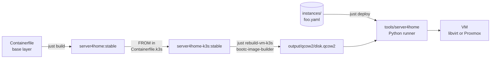
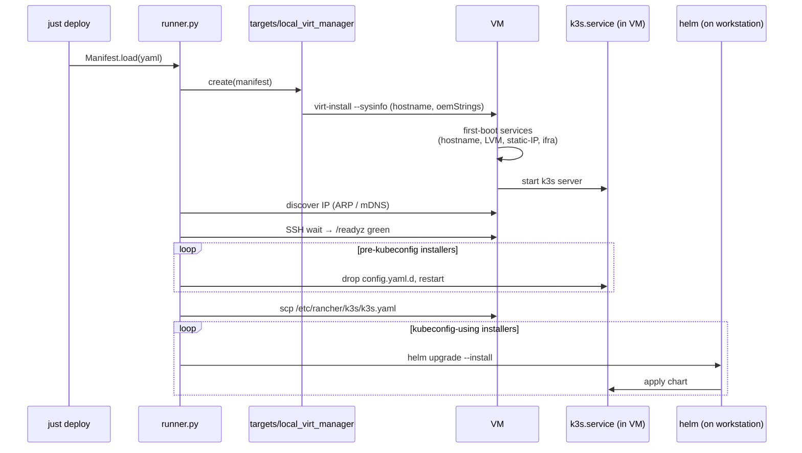

# server4home-k3s — build & deploy guide

How the pieces fit together when you've been away from this for a while.
The image is a fixed **platform** (K3s + Helm + first-boot services); each VM
is described by a YAML **manifest** under [`instances/`](../instances/); a
Python runner under [`tools/`](../tools/) turns the manifest into a running,
configured VM.

---

## 1. The build pipeline



- **Base layer** — ucore-hci (Fedora CoreOS 43) + your customizations.
- **K3s layer** — base + `/usr/bin/k3s` + `/usr/bin/helm` + first-boot services:
  `set-hostname`, `setup-rancher-data` (LVM), `network-static`, `ifra-register`.
- **BIB** converts the OCI image into a bootable qcow2 (xfs root).
- **Runner** reads a manifest, calls into target/provisioner/installer plugins,
  deploys the VM, applies helm charts over the resulting cluster.

There is **no longer** a "Rancher flavor" image. Rancher is now an installer
plugin that runs against any K3s cluster the runner brings up.

### Build commands

```bash
just build-k3s                              # base + K3s container image
just rebuild-vm-k3s                         # build-k3s + BIB -> output/qcow2/disk.qcow2
just rebuild-vm-k3s stable v1.35.4+k3s1     # pin a different K3s version
```

K3s version pin lives in [`Containerfile.k3s`](../Containerfile.k3s) and
[`Justfile`](../Justfile). Helm version pin lives in
[`build/k3s/install.sh`](../build/k3s/install.sh).

---

## 2. VM disk layout

Each VM gets **two disks**: a small immutable boot disk (the bootc root) and
a large data disk (LVM) holding `/var/lib/rancher` so it can grow without
juggling the OS partition.

```text
┌─────────────────────────────────────────────────────────────────────┐
│ VM (libvirt or Proxmox)                                             │
│                                                                     │
│  ┌──────────────────────┐         ┌──────────────────────────────┐  │
│  │ vda  (boot, ~64 GB)  │         │ vdb  (data, e.g. 100 GB+)    │  │
│  │  ┌─────┐ ┌─────────┐ │         │  ┌─────────────────────────┐ │  │
│  │  │ ESP │ │  /  xfs │ │         │  │ PV → VG `rancher`       │ │  │
│  │  │ EFI │ │  bootc  │ │         │  │       └─ LV `data` xfs  │ │  │
│  │  └─────┘ └─────────┘ │         │  │            ↓            │ │  │
│  │                      │         │  │   /var/lib/rancher      │ │  │
│  └──────────────────────┘         │  └─────────────────────────┘ │  │
│                                   └──────────────────────────────┘  │
└─────────────────────────────────────────────────────────────────────┘
                                                ↑
                            grow online with `lvextend` + `xfs_growfs`
```

Whether the data disk gets attached depends on the manifest's `disks:` list.

---

## 3. The manifest

Canonical example: [`instances/k3s-on-virt-manager.yaml`](../instances/k3s-on-virt-manager.yaml).

```yaml
base: k3s-base
hostname: rancher-cp-01
target: local-virt-manager

resources:
  memory: 16384
  vcpus: 4

disks:
  - path: /var/lib/rancher
    size: 100G
    type: lvm

network:
  - name: default
    type: bridge
    mac:
      provisioner: default          # default | fixed | ifra
    ip:
      provisioner: dhcp             # dhcp | static
      # static: 192.168.120.50/16
      # gateway: 192.168.1.1
      # dns: 192.168.1.1

install:
  - name: k3s
    args:
      - --disable=traefik
      - --disable=servicelb

  - name: rancher-manager
    version: v2.14.1
    config:
      hostname: rancher.lan.example.com
      bootstrapPassword: admin
      replicas: 1
      ingress:
        enabled: true
        tls:
          - secretName: rancher-tls
            hosts: [rancher.lan.example.com]
```

The shape mirrors the four extension points: `target:` picks the deployment
adapter; `network[].mac.provisioner` and `network[].ip.provisioner` pick the
provisioner plugins; each `install:` entry routes to an installer plugin by
`name`.

Validate without deploying:

```bash
just validate instances/foo.yaml
```

---

### How the runner discovers a VM's IP

The runner tries methods in order; the first that produces an answer wins:

1. **Static IP from the manifest** (`ip.provisioner: static`). Zero discovery.
2. **qemu-guest-agent** via `virsh domifaddr --source agent`. The K3s image
   ships `qemu-guest-agent` and the target injects a virtio channel; this is
   the recommended path for DHCP'd VMs.
3. **DNS / mDNS** by hostname (`<hostname>`, `<hostname>.local`, `<hostname>.lan`).
4. **ARP polling** keyed on the libvirt-assigned MAC. Auto-uses `arp-scan` if
   it's on PATH to populate the neighbor table (`brew install arp-scan` on
   atomic OS workstations; no reboot required).

If all four fail, the runner errors out with explicit workarounds.

---

## 4. Deploy flow



`just deploy <manifest>`:

```bash
just deploy instances/k3s-on-virt-manager.yaml
```

The Justfile bootstraps `./.venv/` on first use (`pip install -e tools/`),
then runs `server4home deploy <manifest>`. The kubeconfig lands at
`./kubeconfigs/<hostname>.kubeconfig` for direct use.

### 4.1  Deploying to Proxmox VE 9

The `pve9` target provisions through the Proxmox REST API, with one SSH hop
for `qm importdisk` (the API's own disk-import flow is too clunky for a
qcow2 — even proxmoxer and Ansible's modules shell out for it).

**One-time PVE setup (≈ 2 min):**

1. **Datacenter → Permissions → API Tokens → Add.** User
   `server4home@pve`, Token ID `deploy`, **Privilege Separation ON**
   (the default — *leave it alone*). Copy the one-time-shown secret
   immediately.
2. **Datacenter → Permissions → Add → API Token Permission.** Path `/`,
   API Token `server4home@pve!deploy`, Role `PVEVMAdmin`, Propagate ✓.
3. **Same, second time.** Path `/storage`, API Token `server4home@pve!deploy`,
   Role `PVEDatastoreUser`, Propagate ✓.

The Privilege Separation rule: **ON ⇒ token uses its own ACL; OFF ⇒ token
inherits the user's ACL**. The recipe above grants the *token's* ACL, so
priv-sep must be ON. Symptom of the wrong combination: `GET /access/permissions`
returns `{"data": {}}` and every mutating call comes back `403 Permission
check failed`. Quick check from the workstation:

```bash
TOKEN=$(.venv/bin/python3 -c "from server4home.secrets.local import LocalSecretProvider; print(LocalSecretProvider().get('proxmox/api-token'))")
curl -ks -H "Authorization: PVEAPIToken=$TOKEN" \
    "https://${PVE_HOST:-pve9.local.homelabsolutions.net}:8006/api2/json/access/permissions" \
    | python3 -m json.tool | head
```

Should show non-empty `/` and `/storage` blocks. If empty, flip priv-sep.
4. **SSH key to `root@<pve>`.** `ssh-copy-id root@pve9.local.homelabsolutions.net`
   (required only for the `qm importdisk` hop).

**Secrets** in `secrets/secrets.yaml`:

```yaml
"proxmox/api-token":      "server4home@pve!deploy=<UUID>"
"k3s/homelab/node-token": "K10..."   # from /var/lib/rancher/k3s/server/node-token on the existing CP
```

**Environment** (defaults shown; override per-VM only if you have to):

```bash
export PVE_HOST=pve9.local.homelabsolutions.net
export PVE_NODE=pve9
export PVE_STORAGE=local-lvm
export PVE_BRIDGE=vmbr0
```

**Deploy** an additional control-plane node joining the existing libvirt
cluster:

```bash
just deploy instances/k3s-rancher-on-ucore-pve-vm.yaml
```

**Verification:**

```bash
KC=./kubeconfigs/k3s-test-on-virt-manager.kubeconfig   # existing CP's kubeconfig
kubectl --kubeconfig $KC get nodes -o wide
# Expected: 2 nodes, both Ready, both 'control-plane,etcd'
```

**Why two SSH hops** to `root@pve` are unavoidable even with the API token:

1. **`qm importdisk`** — the API's disk-import endpoint expects raw, pre-uploaded blobs and is genuinely awkward for qcow2. Even proxmoxer and Ansible shell out for this.
2. **`qm set --args`** — Proxmox guards the QEMU `args` field so **only literal `root@pam` over the local CLI** can set it; API tokens (even with `Administrator` role) get `500: only root can set 'args' config`. We carry the SMBIOS OEM strings (which the K3s-join + static-IP + exact-hostname first-boot services read) via `args`, so we set it through SSH after creating the VM.

These two hops are why the `pve9` target requires `ssh root@<pve>` key-auth from the workstation, on top of the API token.

**Caveat — 2-node etcd quorum:** once the second CP joins, etcd needs 2-of-2
votes for quorum. That's *less* robust than a single-node etcd — any one
member failing halts the cluster. Fine for a one-time validation; add a
third CP before you call it stable.

**What the runner does step-by-step**: it's spelled out in
[tools/README.md → Environment overrides](../tools/README.md#environment-overrides)
and in the `pve9` plugin's module docstring
([tools/server4home/targets/pve9.py](../tools/server4home/targets/pve9.py)).

---

## 5. Plugin architecture

Five extension points, all in [`tools/server4home/registry.py`](../tools/server4home/registry.py):

| Registry | Location | Built-ins (today) |
| --- | --- | --- |
| `targets` | `tools/server4home/targets/` | `local-virt-manager`, `pve9` |
| `mac_provisioners` | `tools/server4home/provisioners/mac.py` | `default`, `fixed`, `ifra` (stub) |
| `ip_provisioners` | `tools/server4home/provisioners/ip.py` | `dhcp`, `static` |
| `installers` | `tools/server4home/installers/` | `k3s`, `cert-manager`, `rancher-manager`, `kubernetes-secret`, `metallb` |
| `secret_providers` | `tools/server4home/secrets/` | `local` |

Adding a plugin is purely additive: subclass the right ABC, add a
`@<registry>.register("<key>")` decorator, import the module from its
subpackage's `__init__.py`. The runner picks it up by name from any manifest
that references it. See [`tools/README.md`](../tools/README.md) for a worked
example (Longhorn).

### Secrets — never in git

Manifests reference secrets by name, never by value:

```yaml
install:
  - name: k3s
    config:
      mode: agent
      server: https://k3s-cp-01.lan:6443
      token: { secret: "k3s/homelab/agent-token" }
```

At deploy time the runner resolves every `{ secret: <name> }` through a
secret-provider plugin. The `local` provider reads `secrets/secrets.yaml`
(gitignored — copy [`secrets/secrets.example.yaml`](../secrets/secrets.example.yaml)).
A future `ifra` provider will fetch from the homelab inventory API with **no
manifest change** — same reference, different backend.

For a K3s join token specifically: the runner resolves it, then the
`local-virt-manager` target injects mode/server/token as SMBIOS OEM strings.
The VM's first-boot `k3s-config.sh` writes `/etc/server4home/k3s.conf` from
them *before* `k3s.service` starts, so the node boots already joined. The
token never touches a git-tracked file — only the gitignored secret store
and SMBIOS (the latter no more exposed than the token already is on any K3s
node).

---

## 6. First-boot sequence inside the VM

Even with the runner doing most of the work from the workstation, four
oneshot services still run inside the VM at first boot to absorb the SMBIOS
inputs:

```mermaid
sequenceDiagram
    participant systemd
    participant netstatic as server4home-network-static
    participant hostname as server4home-hostname
    participant data as setup-rancher-data
    participant ifra as server4home-ifra-register
    participant k3s as k3s.service

    systemd->>netstatic: Before=NetworkManager.service
    netstatic->>netstatic: read SMBIOS OEM strings; if static IP requested,<br/>write NM keyfile
    systemd->>hostname: read SMBIOS; set exact hostname
    systemd->>data: claim unformatted disk → LVM → mount /var/lib/rancher
    par
        systemd->>ifra: POST mac+hostname to inventory (best-effort)
    and
        systemd->>k3s: After=hostname.service, setup-rancher-data.service
        k3s->>k3s: k3s server (reads /etc/rancher/k3s/config.yaml + .d)
    end
```

---

### Data-disk identity check (preserved state vs. manifest hostname)

`just deploy` preserves the LVM data disk across re-deploys — great when
you're just refreshing the OS (bootc upgrade pattern), but it bites when
the cluster's identity (hostname → etcd member name, certs) changes between
deploys. Symptoms: K3s restart-loops with `Detected member only in v3store
but missing in v2store` or the apiserver flapping between Ready and
NotReady.

The runner guards against this with an **identity sidecar**. When it
creates the data disk, it writes
`/var/lib/libvirt/images/<vm>-data.meta.json` recording the manifest
hostname (and a few other identity bits). On every subsequent
`just deploy`, before any destructive action, the runner reads the
sidecar and refuses with `IdentityMismatchError` if the manifest's
`hostname:` no longer matches what the data disk was created for. The
error includes the exact command to recover:

```bash
just deploy-fresh instances/<your-manifest>.yaml
# equivalent: server4home deploy --wipe-data instances/<your-manifest>.yaml
```

`deploy-fresh` removes the data disk + sidecar, then runs the normal
deploy, so K3s starts on truly fresh state. (`just destroy` also removes
the sidecar — `--remove-all-storage` doesn't, because the sidecar lives
outside libvirt's pool bookkeeping.)

### No firewalld in the image — by design

The base ucore-hci image ships `firewalld` with the FedoraServer zone, which
allows only `cockpit / dhcpv6-client / ssh`. K3s needs at minimum 6443
(kube-api), 10250 (kubelet), and 8472/UDP (flannel) reachable from peers
and clients — firewalld's defaults reject those with
`icmp-host-unreachable`, producing exactly "no route to host" on kubectl /
helm calls. The K3s upstream docs explicitly say to disable firewalld for
this reason.

The K3s image therefore **removes the firewalld package** at build time
([build/k3s/install.sh](../build/k3s/install.sh)). If you need a host
firewall, layer one on top per-VM (nftables rules dropped at first boot)
rather than putting firewalld back in the image.

---

## 7. Day-2 operations

### Extend `/var/lib/rancher` when it fills up

```bash
# On the libvirt host:
sudo virsh blockresize <vm> --path /var/lib/libvirt/images/<vm>-data.qcow2 --size 200G

# On the VM:
sudo pvresize /dev/vdb
sudo lvextend -l +100%FREE /dev/rancher/data
sudo xfs_growfs /var/lib/rancher
```

All online; K3s keeps running.

### Datastore: embedded etcd by default

New clusters start with **embedded etcd** (`cluster-init: true`), not K3s's
default SQLite. This is decided at first boot by `k3s-config.sh` and is a
**one-way door** — the datastore can't be changed in place afterwards.

- **etcd** (default): HA-capable. A single-node etcd cluster runs fine and
  can later grow to a 3-node quorum by joining two more `mode: server`
  nodes. Required if you'll ever add control-plane nodes.
- **sqlite** (opt-out): set `datastore: sqlite` in the manifest's `k3s`
  install config. Lighter, but permanently single-node — no HA, no extra
  servers ever.

Joining nodes (`server` with a `server:` URL, or `agent`) never get
`cluster-init` — they attach to the existing cluster's datastore.

### Back up / restore the cluster (etcd snapshots)

For an etcd cluster, `k3s` has snapshotting built in — this is your "clone",
not VM cloning:

```bash
# On a server node — manual snapshot:
sudo k3s etcd-snapshot save

# Snapshots live in /var/lib/rancher/k3s/server/db/snapshots/
sudo k3s etcd-snapshot ls

# Restore (cluster down) from a snapshot:
sudo k3s server --cluster-reset \
  --cluster-reset-restore-path=/var/lib/rancher/k3s/server/db/snapshots/<snap>
```

Scheduled snapshots can be enabled via `config.yaml`
(`etcd-snapshot-schedule-cron`, `etcd-snapshot-retention`), and pushed to S3.

### Upgrade a VM via bootc

CI publishes two images on every push to `main` and on the nightly cron
([.github/workflows/build.yml](../.github/workflows/build.yml)):

- `ghcr.io/dx4homelab/server4home` (base)
- `ghcr.io/dx4homelab/server4home-k3s` (K3s flavor — what your VMs run)

Each image is tagged `stable`, `stable.<YYYYMMDD>`, and `<YYYYMMDD>` (plus
`sha-…` for PR builds). The date-stamped tags are de-facto immutable;
`stable` rolls. Both images are cosign-signed using the repo's
`SIGNING_SECRET`.

```bash
# First time on a VM that doesn't yet point at the registry — only once:
sudo bootc switch ghcr.io/dx4homelab/server4home-k3s:stable

# Subsequent upgrades:
sudo bootc upgrade --apply          # --apply auto-reboots

# Pin to a specific build (recommended for HA control-plane nodes —
# upgrade one node at a time, verify, then roll forward the others):
sudo bootc switch ghcr.io/dx4homelab/server4home-k3s:stable.20260523

# Inspect current and staged deployments:
bootc status
```

The root deployment swaps atomically. `/var/lib/rancher` is on the data
disk, untouched by `bootc upgrade`, so K3s's etcd and certs survive — the
node rejoins its cluster after reboot with the same identity. If the new
image regresses, `sudo bootc rollback` reverts to the previous deployment
on the next boot.

### Automatic upgrades + scheduled etcd snapshots — what's enabled by default

The K3s image bakes in **two scheduled things** so a freshly-deployed VM
keeps itself patched and recoverable without operator action:

| Service | Schedule | What it does | Where the symlink lives |
| --- | --- | --- | --- |
| `bootc-fetch-apply-updates.timer` | `OnBootSec=1h`, `OnUnitInactiveSec=8h`, ±2h jitter | Runs `bootc upgrade --apply` against the registry image the VM was last switched to — pulls and reboots only if a new digest is available | `build/k3s/files/usr/lib/systemd/system/timers.target.wants/bootc-fetch-apply-updates.timer` (symlinks to the bootc RPM's unit) |
| K3s `etcd-snapshot-schedule-cron` | every 6 hours (`0 */6 * * *`), retain 5 | Writes an embedded-etcd snapshot to `/var/lib/rancher/k3s/server/db/snapshots/` on the LVM data disk | `build/k3s/files/etc/rancher/k3s/config.yaml` |

These pair on purpose: an etcd snapshot is taken every 6h, so any rebooting
auto-upgrade has a recent restore point if the new image regresses. The
snapshots live on the data disk (preserved across `bootc upgrade`), so a
broken root deployment never takes the backups with it.

**To disable on a specific VM** (e.g., for production HA control-plane
nodes you'd rather roll manually):

```bash
sudo systemctl disable --now bootc-fetch-apply-updates.timer
# k3s snapshots: drop /etc/rancher/k3s/config.yaml.d/99-disable-snapshots.yaml
# with `etcd-snapshot-schedule-cron: ""`
```

**To send snapshots off-host (S3 / Minio)** add to
[build/k3s/files/etc/rancher/k3s/config.yaml](../build/k3s/files/etc/rancher/k3s/config.yaml)
or a local config.yaml.d drop-in:

```yaml
etcd-s3: true
etcd-s3-endpoint: minio.lan.example.com:9000
etcd-s3-bucket: k3s-etcd-snapshots
etcd-s3-access-key: { secret: "minio/access-key" }
etcd-s3-secret-key: { secret: "minio/secret-key" }
```

**HA caveat**: the bootc timer doesn't coordinate across nodes. If you
eventually run 3-node HA control planes, stagger the timers (different
`OnCalendar=` per node via a drop-in) or upgrade manually one node at a
time to keep quorum during reboots.

### Making the GHCR packages pullable from VMs

GHCR container packages start **private** even when the source repo is
public. One-time setup so VMs can `bootc upgrade` anonymously:

1. Browse `https://github.com/dx4homelab?tab=packages` → click each
   package (`server4home`, `server4home-k3s`).
2. Package settings → "Change package visibility" → **Public**.
3. (Optional) "Manage Actions access" → ensure the source repo is
   permitted so future workflow runs can keep pushing.

Or via gh CLI:

```bash
gh api --method PATCH /user/packages/container/server4home   -f visibility=public
gh api --method PATCH /user/packages/container/server4home-k3s -f visibility=public
```

(Substitute `/orgs/<org>/...` if publishing under an organization.)

### Verifying cosign signatures on a VM (optional)

To require valid signatures before `bootc upgrade` accepts an image:

```bash
# Extract the public key from your local cosign.key (one-time, on the
# workstation where you keep the key):
cosign public-key --key cosign.key > cosign.pub

# On the VM:
sudo install -m 0644 cosign.pub /etc/pki/containers/server4home.pub
sudo tee /etc/containers/policy.json >/dev/null <<'JSON'
{
  "default": [{"type": "insecureAcceptAnything"}],
  "transports": {
    "docker": {
      "ghcr.io/dx4homelab": [{
        "type": "sigstoreSigned",
        "keyPath": "/etc/pki/containers/server4home.pub"
      }]
    }
  }
}
JSON
```

After this, an unsigned or tampered image in `ghcr.io/dx4homelab/*` causes
`bootc upgrade` to refuse.

### Cluster admin

```bash
KUBECONFIG=./kubeconfigs/<vm>.kubeconfig kubectl get nodes
KUBECONFIG=./kubeconfigs/<vm>.kubeconfig helm list -A
```

---

## 8. Adding custom commands and hooks

Pick by use-case:

| What you want to run | Where it goes | Idempotency |
| --- | --- | --- |
| File goes into rootfs once at build | `build/k3s/files/<absolute-path>` (COPY'd into image) | Trivial — file is in `/usr` |
| Modify the image *during* build | Append to `build/k3s/install.sh` (runs inside `podman build`) | One-shot at build time |
| Run once on first boot of a VM | New `[Service] Type=oneshot` unit, like the existing first-boot services | Internal check (sentinel or live state) |
| Run on every K3s start | Drop-in `build/k3s/files/usr/lib/systemd/system/k3s.service.d/NN-foo.conf` | Make the command itself idempotent |
| Workload to install on the cluster | New installer plugin under `tools/server4home/installers/` | Helm is naturally idempotent (`helm upgrade --install`) |
| K3s startup flag | Add a key to [build/k3s/files/etc/rancher/k3s/config.yaml](../build/k3s/files/etc/rancher/k3s/config.yaml) | K3s re-applies on every start |

**Prefer K3s's native config over chmod/chown when possible.** K3s rewrites
its state files (kubeconfig, certs) on restart, so out-of-band file changes
get clobbered. Use `config.yaml` or `config.yaml.d/` instead.

For operator-overridable config (not baked, dropped on the VM at deploy time),
use `/etc/rancher/k3s/config.yaml.d/*.yaml` — K3s merges those over the
image-baked `config.yaml`. This is the same mechanism the `k3s` installer
plugin uses to apply manifest-supplied `args:`.

---

## 9. Where things live in this repo

| Path | Purpose |
| --- | --- |
| [Containerfile](../Containerfile) | Base server4home image |
| [Containerfile.k3s](../Containerfile.k3s) | Layered K3s image |
| [build/k3s/install.sh](../build/k3s/install.sh) | K3s + Helm install at image-build time |
| [build/k3s/files/](../build/k3s/files/) | All files baked into the K3s image rootfs |
| [build/k3s/files/usr/libexec/server4home/setup-rancher-data.sh](../build/k3s/files/usr/libexec/server4home/setup-rancher-data.sh) | First-boot LVM setup |
| [build/k3s/files/usr/libexec/server4home/set-hostname.sh](../build/k3s/files/usr/libexec/server4home/set-hostname.sh) | First-boot hostname (exact mode + prefix-suffix fallback) |
| [build/k3s/files/usr/libexec/server4home/network-static.sh](../build/k3s/files/usr/libexec/server4home/network-static.sh) | First-boot static-IP NM keyfile writer |
| [build/k3s/files/usr/libexec/server4home/k3s-config.sh](../build/k3s/files/usr/libexec/server4home/k3s-config.sh) | First-boot writer of /etc/server4home/k3s.conf from SMBIOS (join config) |
| [build/k3s/files/usr/libexec/server4home/ifra-register.sh](../build/k3s/files/usr/libexec/server4home/ifra-register.sh) | First-boot inventory registration |
| [secrets/secrets.example.yaml](../secrets/secrets.example.yaml) | Template for the gitignored local secret store |
| [tools/server4home/secrets/](../tools/server4home/secrets/) | Secret-provider plugins (`local`; `ifra` later) |
| [build/k3s/files/etc/rancher/k3s/config.yaml](../build/k3s/files/etc/rancher/k3s/config.yaml) | Baked K3s config (kubeconfig perms, etc.) |
| [build/k3s/files/etc/server4home/k3s.conf.example](../build/k3s/files/etc/server4home/k3s.conf.example) | K3s runtime mode config template |
| [iso/disk.toml](../iso/disk.toml) | BIB qcow2/raw partitioning + baked user |
| [iso/iso.toml](../iso/iso.toml) | Anaconda ISO kickstart |
| [Justfile](../Justfile) | All build/run/deploy recipes |
| [instances/](../instances/) | Per-VM YAML manifests |
| [tools/](../tools/) | Python deploy runner (`server4home` CLI) |
| [tools/server4home/](../tools/server4home/) | Runner package source |
| [tools/README.md](../tools/README.md) | Runner CLI quickstart + plugin authoring |
| [tools/server4home/targets/pve9.py](../tools/server4home/targets/pve9.py) | Manifest-driven Proxmox VE 9 target (REST API + ssh hop for qm importdisk) |
| [instances/k3s-rancher-on-ucore-pve-vm.yaml](../instances/k3s-rancher-on-ucore-pve-vm.yaml) | Example manifest for an additional CP node joining via Proxmox |
| [helpers/proxmox/create-rancher-vm.sh](../helpers/proxmox/create-rancher-vm.sh) | Manual Proxmox provisioning (predates the `pve9` target; kept for ad-hoc use) |
| [helpers/network/set-correct-bridge.sh](../helpers/network/set-correct-bridge.sh) | One-shot host bridge setup (br0) |
